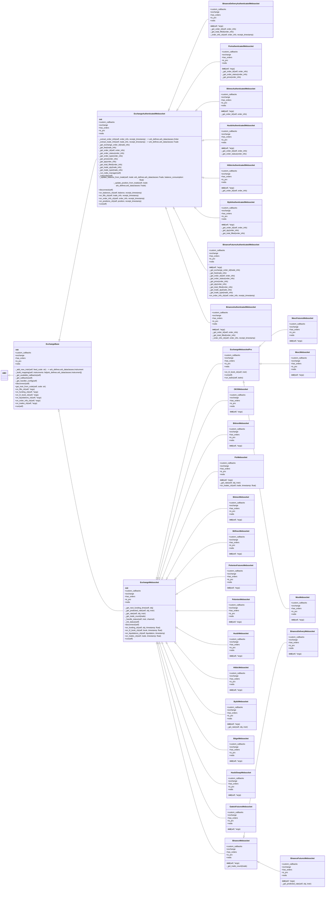

# UML Diagram

```mermaid
classDiagram
	direction LR
	ExchangeBase <|-- ExchangeAuthenticatedWebsocket
	class ExchangeAuthenticatedWebsocket {
		-__init__
		-_extract_order_info(self, order_info, receipt_timestamp) -> arb_defines.arb_dataclasses.Order
		-_extract_trade_info(self, trade_info, receipt_timestamp) -> arb_defines.arb_dataclasses.Trade
		-_get_exchange_order_id(trade_info)
		-_get_fee(trade_info)
		-_get_order_id(self, order_info)
		-_get_order_status(order_info)
		-_get_order_type(order_info)
		-_get_price(order_info)
		-_get_qty(order_info)
		-_get_total_filled(order_info)
		-_get_trade_qty(trade_info)
		-_get_trade_type(trade_info)
		-_run_redis_manager(self)
		-_subscribe(self)
		-_update_balance_from_trade(self, trade: arb_defines.arb_dataclasses.Trade, balance_consumption: float)
		-_update_position_from_trade(self, trade: arb_defines.arb_dataclasses.Trade)
		+custom_callbacks
		+disconnect(self)
		+exchange
		+has_orders
		+is_pro
		+on_balances_cb(self, balance, receipt_timestamp)
		+on_fills_cb(self, trade_info, receipt_timestamp)
		+on_order_info_cb(self, order_info, receipt_timestamp)
		+on_positions_cb(self, position, receipt_timestamp)
		+redis
		+run(self)
	}
	ExchangeBase <|-- ExchangeWebsocket
	class ExchangeWebsocket {
		-__init__
		-_get_next_funding_time(self, obj)
		-_get_predicted_rate(self, obj, instr)
		-_get_rate(sefl, obj, instr)
		-_get_trade_count(trade)
		-_handle_status(self, instr, channel)
		-_init_status(self)
		+custom_callbacks
		+disconnect(self)
		+exchange
		+has_orders
		+is_pro
		+on_funding_cb(self, obj, timestamp: float)
		+on_l2_book_cb(self, book, timestamp: float)
		+on_liquidations_cb(self, liquidation, timestamp)
		+on_trades_cb(self, trade, timestamp: float)
		+redis
		+run(self)
	}
	ABC <|-- ExchangeBase
	class ExchangeBase {
		-__init__
		-_add_new_instr(self, feed_code: str) -> arb_defines.arb_dataclasses.Instrument
		-_build_mapping(self, instruments: list[arb_defines.arb_dataclasses.Instrument])
		-_get_available_callbacks(self)
		-_get_callbacks(self)
		-_get_handler_config(self)
		+custom_callbacks
		+disconnect(self)
		+exchange
		+get_instr_from_code(self, code: str)
		+has_orders
		+is_pro
		+on_fills_cb(self, *args)
		+on_funding_cb(self, *args)
		+on_l2_book_cb(self, *args)
		+on_liquidations_cb(self, *args)
		+on_order_info_cb(self, *args)
		+on_trades_cb(self, *args)
		+redis
		+run(self)
	}
	ExchangeWebsocket <|-- ExchangeWebsocketPro
	class ExchangeWebsocketPro {
		+custom_callbacks
		+exchange
		+has_orders
		+is_pro
		+on_l2_book_cb(self, instr)
		+redis
		+run(self)
		+run_tasks(self, tasks)
	}
	ExchangeWebsocket <|-- OKXWebsocket
	class OKXWebsocket {
		-__init__(self, *args)
		+custom_callbacks
		+exchange
		+has_orders
		+is_pro
		+redis
	}
	ExchangeWebsocket <|-- BittrexWebsocket
	class BittrexWebsocket {
		-__init__(self, *args)
		+custom_callbacks
		+exchange
		+has_orders
		+is_pro
		+redis
	}
	ExchangeAuthenticatedWebsocket <|-- BinanceDeliveryAuthenticatedWebsocket
	class BinanceDeliveryAuthenticatedWebsocket {
		-__init__(self, *args)
		-_get_order_id(self, order_info)
		-_get_total_filled(order_info)
		-_order_info_cb(self, order_info, receipt_timestamp)
		+custom_callbacks
		+exchange
		+has_orders
		+is_pro
		+redis
	}
	BinanceWebsocket <|-- BinanceDeliveryWebsocket
	class BinanceDeliveryWebsocket {
		-__init__(self, *args)
		+custom_callbacks
		+exchange
		+has_orders
		+is_pro
		+redis
	}
	ExchangeWebsocketPro <|-- MexcFuturesWebsocket
	class MexcFuturesWebsocket {
		-__init__(self, *args)
		+custom_callbacks
		+exchange
		+has_orders
		+is_pro
		+redis
	}
	ExchangeWebsocket <|-- FtxWebsocket
	class FtxWebsocket {
		-__init__(self, *args)
		-_get_rate(sefl, obj, instr)
		+custom_callbacks
		+exchange
		+has_orders
		+is_pro
		+on_trades_cb(self, trade, timestamp: float)
		+redis
	}
	ExchangeAuthenticatedWebsocket <|-- FtxAuthenticatedWebsocket
	class FtxAuthenticatedWebsocket {
		-__init__(self, *args)
		-_get_order_id(self, order_info)
		-_get_order_status(order_info)
		-_get_price(order_info)
		+custom_callbacks
		+exchange
		+has_orders
		+is_pro
		+redis
	}
	ExchangeAuthenticatedWebsocket <|-- BitmexAuthenticatedWebsocket
	class BitmexAuthenticatedWebsocket {
		-__init__(self, *args)
		-_get_order_id(self, order_info)
		+custom_callbacks
		+exchange
		+has_orders
		+is_pro
		+redis
	}
	ExchangeWebsocket <|-- BitmexWebsocket
	class BitmexWebsocket {
		-__init__(self, *args)
		+custom_callbacks
		+exchange
		+has_orders
		+is_pro
		+redis
	}
	ExchangeWebsocket <|-- BitfinexWebsocket
	class BitfinexWebsocket {
		-__init__(self, *args)
		+custom_callbacks
		+exchange
		+has_orders
		+is_pro
		+redis
	}
	ExchangeWebsocket <|-- PoloniexFuturesWebsocket
	class PoloniexFuturesWebsocket {
		-__init__(self, *args)
		+custom_callbacks
		+exchange
		+has_orders
		+is_pro
		+redis
	}
	ExchangeWebsocketPro <|-- MexcWebsocket
	class MexcWebsocket {
		-__init__(self, *args)
		+custom_callbacks
		+exchange
		+has_orders
		+is_pro
		+redis
	}
	ExchangeWebsocket <|-- PoloniexWebsocket
	class PoloniexWebsocket {
		-__init__(self, *args)
		+custom_callbacks
		+exchange
		+has_orders
		+is_pro
		+redis
	}
	ExchangeWebsocket <|-- HuobiWebsocket
	class HuobiWebsocket {
		-__init__(self, *args)
		+custom_callbacks
		+exchange
		+has_orders
		+is_pro
		+redis
	}
	ExchangeAuthenticatedWebsocket <|-- HuobiAuthenticatedWebsocket
	class HuobiAuthenticatedWebsocket {
		-__init__(self, *args)
		-_get_order_id(self, order_info)
		-_get_order_status(order_info)
		+custom_callbacks
		+exchange
		+has_orders
		+is_pro
		+redis
	}
	ExchangeWebsocket <|-- HitbtcWebsocket
	class HitbtcWebsocket {
		-__init__(self, *args)
		+custom_callbacks
		+exchange
		+has_orders
		+is_pro
		+redis
	}
	ExchangeAuthenticatedWebsocket <|-- HitbtcAuthenticatedWebsocket
	class HitbtcAuthenticatedWebsocket {
		-__init__(self, *args)
		-_get_order_id(self, order_info)
		+custom_callbacks
		+exchange
		+has_orders
		+is_pro
		+redis
	}
	ExchangeAuthenticatedWebsocket <|-- BybitAuthenticatedWebsocket
	class BybitAuthenticatedWebsocket {
		-__init__(self, *args)
		-_get_order_id(self, order_info)
		-_get_qty(order_info)
		-_get_total_filled(order_info)
		+custom_callbacks
		+exchange
		+has_orders
		+is_pro
		+redis
	}
	ExchangeWebsocket <|-- BybitWebsocket
	class BybitWebsocket {
		-__init__(self, *args)
		-_get_rate(self, obj, instr)
		+custom_callbacks
		+exchange
		+has_orders
		+is_pro
		+redis
	}
	ExchangeWebsocket <|-- BitgetWebsocket
	class BitgetWebsocket {
		-__init__(self, *args)
		+custom_callbacks
		+exchange
		+has_orders
		+is_pro
		+redis
	}
	ExchangeWebsocket <|-- HuobiSwapWebsocket
	class HuobiSwapWebsocket {
		-__init__(self, *args)
		+custom_callbacks
		+exchange
		+has_orders
		+is_pro
		+redis
	}
	ExchangeWebsocketPro <|-- WooWebsocket
	class WooWebsocket {
		-__init__(self, *args)
		+custom_callbacks
		+exchange
		+has_orders
		+is_pro
		+redis
	}
	ExchangeWebsocket <|-- GateioFuturesWebsocket
	class GateioFuturesWebsocket {
		-__init__(self, *args)
		+custom_callbacks
		+exchange
		+has_orders
		+is_pro
		+redis
	}
	ExchangeAuthenticatedWebsocket <|-- BinanceFuturesAuthenticatedWebsocket
	class BinanceFuturesAuthenticatedWebsocket {
		-__init__(self, *args)
		-_get_exchange_order_id(trade_info)
		-_get_fee(trade_info)
		-_get_order_id(self, order_info)
		-_get_order_status(order_info)
		-_get_price(order_info)
		-_get_qty(order_info)
		-_get_total_filled(order_info)
		-_get_trade_qty(trade_info)
		-_get_trade_type(trade_info)
		+custom_callbacks
		+exchange
		+has_orders
		+is_pro
		+on_order_info_cb(self, order_info, receipt_timestamp)
		+redis
	}
	BinanceWebsocket <|-- BinanceFuturesWebsocket
	class BinanceFuturesWebsocket {
		-__init__(self, *args)
		-_get_predicted_rate(self, obj, instr)
		+custom_callbacks
		+exchange
		+has_orders
		+is_pro
		+redis
	}
	ExchangeWebsocket <|-- BinanceWebsocket
	class BinanceWebsocket {
		-__init__(self, *args)
		-_get_trade_count(trade)
		+custom_callbacks
		+exchange
		+has_orders
		+is_pro
		+redis
	}
	ExchangeAuthenticatedWebsocket <|-- BinanceAuthenticatedWebsocket
	class BinanceAuthenticatedWebsocket {
		-__init__(self, *args)
		-_get_order_id(self, order_info)
		-_get_total_filled(order_info)
		-_order_info_cb(self, order_info, receipt_timestamp)
		+custom_callbacks
		+exchange
		+has_orders
		+is_pro
		+redis
	}
```
