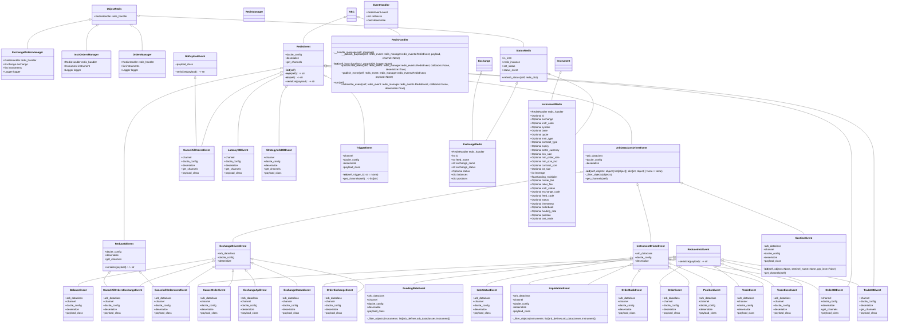

# UML Diagram

```mermaid
classDiagram
	ObjectRedis <|-- ExchangeOrdersManager
	class ExchangeOrdersManager {
		+RedisHandler redis_handler
		+Exchange exchange
		+list instruments
		+Logger logger
	}
	ObjectRedis <|-- InstrOrdersManager
	class InstrOrdersManager {
		+RedisHandler redis_handler
		+Instrument instrument
		+Logger logger
	}
	ObjectRedis <|-- OrdersManager
	class OrdersManager {
		+RedisHandler redis_handler
		+list instruments
		+Logger logger
	}
	class RedisManager {
	}
	RedisEvent <|-- ArbDataclassDriverEvent
	class ArbDataclassDriverEvent {
		-__init__(self, objects: object | list[object] | dict[int, object] | None = None)
		-_filter_objects(objects)
		+arb_dataclass
		+dacite_config
		+deserialize
		+get_channels(self)
	}
	ExchangeDrivenEvent <|-- BalanceEvent
	class BalanceEvent {
		+arb_dataclass
		+channel
		+dacite_config
		+deserialize
		+payload_class
	}
	NoPayloadEvent <|-- CancelAllOrdersEvent
	RedisEvent <|-- CancelAllOrdersEvent
	class CancelAllOrdersEvent {
		+channel
		+dacite_config
		+deserialize
		+get_channels
		+payload_class
	}
	ReduceIdEvent <|-- CancelAllOrdersExchangeEvent
	ExchangeDrivenEvent <|-- CancelAllOrdersExchangeEvent
	class CancelAllOrdersExchangeEvent {
		+arb_dataclass
		+channel
		+dacite_config
		+deserialize
		+payload_class
	}
	ReduceIdEvent <|-- CancelAllOrdersInstrEvent
	ExchangeDrivenEvent <|-- CancelAllOrdersInstrEvent
	class CancelAllOrdersInstrEvent {
		+arb_dataclass
		+channel
		+dacite_config
		+deserialize
		+payload_class
	}
	ReduceInstrEvent <|-- CancelOrderEvent
	ExchangeDrivenEvent <|-- CancelOrderEvent
	class CancelOrderEvent {
		+arb_dataclass
		+channel
		+dacite_config
		+deserialize
		+payload_class
	}
	ExchangeDrivenEvent <|-- ExchangeApiEvent
	class ExchangeApiEvent {
		+arb_dataclass
		+channel
		+dacite_config
		+deserialize
		+payload_class
	}
	ArbDataclassDriverEvent <|-- ExchangeDrivenEvent
	class ExchangeDrivenEvent {
		+arb_dataclass
		+dacite_config
		+deserialize
	}
	ExchangeDrivenEvent <|-- ExchangeStatusEvent
	class ExchangeStatusEvent {
		+arb_dataclass
		+channel
		+dacite_config
		+deserialize
		+payload_class
	}
	InstrumentDrivenEvent <|-- FundingRateEvent
	class FundingRateEvent {
		-_filter_objects(instruments: list[arb_defines.arb_dataclasses.Instrument])
		+arb_dataclass
		+channel
		+dacite_config
		+deserialize
		+payload_class
	}
	InstrumentDrivenEvent <|-- InstrStatusEvent
	class InstrStatusEvent {
		+arb_dataclass
		+channel
		+dacite_config
		+deserialize
		+payload_class
	}
	ArbDataclassDriverEvent <|-- InstrumentDrivenEvent
	class InstrumentDrivenEvent {
		+arb_dataclass
		+dacite_config
		+deserialize
	}
	RedisEvent <|-- LatencyDBEvent
	class LatencyDBEvent {
		+channel
		+dacite_config
		+deserialize
		+get_channels
		+payload_class
	}
	ReduceInstrEvent <|-- LiquidationEvent
	InstrumentDrivenEvent <|-- LiquidationEvent
	class LiquidationEvent {
		-_filter_objects(instruments: list[arb_defines.arb_dataclasses.Instrument])
		+arb_dataclass
		+channel
		+dacite_config
		+deserialize
		+payload_class
	}
	class NoPayloadEvent {
		+payload_class
		+serialize(payload) -> str
	}
	InstrumentDrivenEvent <|-- OrderBookEvent
	class OrderBookEvent {
		+arb_dataclass
		+channel
		+dacite_config
		+deserialize
		+payload_class
	}
	ReduceInstrEvent <|-- OrderDBEvent
	RedisEvent <|-- OrderDBEvent
	class OrderDBEvent {
		+channel
		+dacite_config
		+deserialize
		+get_channels
		+payload_class
	}
	ReduceInstrEvent <|-- OrderEvent
	InstrumentDrivenEvent <|-- OrderEvent
	class OrderEvent {
		+arb_dataclass
		+channel
		+dacite_config
		+deserialize
		+payload_class
	}
	ReduceInstrEvent <|-- OrderExchangeEvent
	ExchangeDrivenEvent <|-- OrderExchangeEvent
	class OrderExchangeEvent {
		+arb_dataclass
		+channel
		+dacite_config
		+deserialize
		+payload_class
	}
	InstrumentDrivenEvent <|-- PositionEvent
	class PositionEvent {
		+arb_dataclass
		+channel
		+dacite_config
		+deserialize
		+payload_class
	}
	ABC <|-- RedisEvent
	class RedisEvent {
		-__init__(self)
		-__repr__(self) -> str
		-__str__(self) -> str
		+dacite_config
		+deserialize
		+get_channels
		+serialize(payload) -> str
	}
	RedisEvent <|-- ReduceIdEvent
	class ReduceIdEvent {
		+dacite_config
		+deserialize
		+get_channels
		+serialize(payload) -> str
	}
	class ReduceInstrEvent {
		+serialize(payload) -> str
	}
	ArbDataclassDriverEvent <|-- SentinelEvent
	class SentinelEvent {
		-__init__(self, objects=None, sentinel_name=None, grp_instr=False)
		+arb_dataclass
		+channel
		+dacite_config
		+deserialize
		+get_channels(self)
		+payload_class
	}
	RedisEvent <|-- StrategyInfoDBEvent
	class StrategyInfoDBEvent {
		+channel
		+dacite_config
		+deserialize
		+get_channels
		+payload_class
	}
	ReduceInstrEvent <|-- TradeDBEvent
	RedisEvent <|-- TradeDBEvent
	class TradeDBEvent {
		+channel
		+dacite_config
		+deserialize
		+get_channels
		+payload_class
	}
	ReduceInstrEvent <|-- TradeEvent
	InstrumentDrivenEvent <|-- TradeEvent
	class TradeEvent {
		+arb_dataclass
		+channel
		+dacite_config
		+deserialize
		+payload_class
	}
	ReduceInstrEvent <|-- TradeExecEvent
	InstrumentDrivenEvent <|-- TradeExecEvent
	class TradeExecEvent {
		+arb_dataclass
		+channel
		+dacite_config
		+deserialize
		+payload_class
	}
	RedisEvent <|-- TriggerEvent
	class TriggerEvent {
		-__init__(self, trigger_id: str = None)
		+channel
		+dacite_config
		+deserialize
		+get_channels(self) -> list[str]
		+payload_class
	}
	class EventHandler {
		+RedisEvent event
		+list callbacks
		+bool deserialize
	}
	ABC <|-- RedisHandler
	class RedisHandler {
		-__handle_message(self, message)
		-__publish_payload(self, redis_event: redis_manager.redis_events.RedisEvent, payload, channel=None)
		-__init__(self, host='localhost', port=6379, logger=None)
		+psubscribe_event(self, redis_event: redis_manager.redis_events.RedisEvent, callbacks=None, deserialize=True)
		+publish_event(self, redis_event: redis_manager.redis_events.RedisEvent, payload=None)
		+run(self)
		+subscribe_event(self, redis_event: redis_manager.redis_events.RedisEvent, callbacks=None, deserialize=True)
	}
	Exchange <|-- ExchangeRedis
	StatusRedis <|-- ExchangeRedis
	class ExchangeRedis {
		+RedisHandler redis_handler
		+int id
		+str feed_name
		+str exchange_name
		+str exchange_status
		+Optional status
		+dict balances
		+dict positions
	}
	Instrument <|-- InstrumentRedis
	StatusRedis <|-- InstrumentRedis
	class InstrumentRedis {
		+RedisHandler redis_handler
		+Optional id
		+Optional exchange
		+Optional instr_code
		+Optional symbol
		+Optional base
		+Optional quote
		+Optional instr_type
		+Optional contract_type
		+Optional expiry
		+Optional settle_currency
		+Optional tick_size
		+Optional min_order_size
		+Optional min_size_incr
		+Optional contract_size
		+Optional lot_size
		+int leverage
		+float funding_multiplier
		+Optional maker_fee
		+Optional taker_fee
		+Optional instr_status
		+Optional exchange_code
		+Optional feed_code
		+Optional status
		+Optional timestamp
		+Optional orderbook
		+Optional funding_rate
		+Optional position
		+Optional last_trade
	}
	class ObjectRedis {
		+RedisHandler redis_handler
	}
	ObjectRedis <|-- StatusRedis
	class StatusRedis {
		+is_instr
		+redis_instance
		+refresh_status(self, redis_dict)
		+set_status
		+status_event
	}
```
